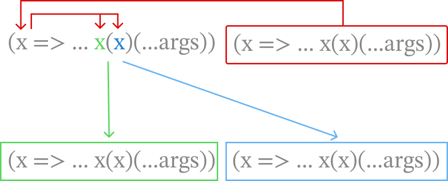

NOTE: This document is a work in progress.

#  A Journey into the Y-combinator

**Y-what?**
Y-combinator! Don't worry about the name. I'll explain the genesis later. It's not complicated. For now, just know we're going to learn how do recursion.

**I know recursion. It's where a function calls itself.**
That's right. Like so:
```javascript
// javascript
function sum(n) {
    if(n == 0) return 0;
    else return n + sum(n-1); // recurse
}

console.log(sum(3)); // prints 3 + 2 + 1 + 0 = 6
```

**I would have thought you'd use a factorial example but ok. Ok so I already know recursion. What are we doing here?**
Well we want to do a special kind of recursion. Where the function is an anonymous function. It has no name. So in javascript we could write:

```javascript
// javascript
((n) => {
    if(n == 0) return 0;
    else return n + ???(n-1); // what do we call here?
})(3 /* call with argument 3 */)
```

**That's easy. Just feed the function into itself as a parameter.**
That's clever. Like so?

```javascript
// javascript
((x, n) => {
    if(n == 0) return 0;
    else return n + x(n-1); 
})(x, 3);
```

**Yes. Easy, peasy. Although I would name the function variable f, but whatever.**
Oh I named it `x` cause that's how it's named in the original literature. I'll talk about it later. Let's get back to our function. What is `x`? How will we send a function into the function if it doesn't even have a name?

**Hmmm. Copy pasta?**
Oh all right. Like so?
```javascript
// javascript
((x, n) => {
    if (n == 0) return 0;
    else return n + x(x, n - 1);
})((x, n) => {
    if (n == 0) return 0;
    else return n + x(x, n - 1);
}, 3); // returns 6
```

**Yeah. It's a little ugly but it works?**
Yes it does. Let's change one little thing. Or two.
```javascript
(x => (...args) => {
    // Extract 'n' from the first element of the 'args' array.
    // In this context, 'n' is expected to be the only argument passed.
    const n = args[0];

    // Base case: If 'n' is 0, the sum is 0.
    if (n === 0) {
        return 0;
    }
    // Recursive step: Add 'n' to the sum of numbers from (n-1) down to 0.
    // 'x(x)' is the way the function calls itself recursively, passing 'n-1'.
    else {
        return n + x(x)(n - 1);
    }
})(
    // The inner function, which is passed as 'x' to the outer function.
    // It also uses '...args' to receive its parameters.
    x => (...args) => {
        const n = args[0];
        if (n === 0) {
            return 0;
        } else {
            return n + x(x)(n - 1);
        }
    }
)(3);
```

**What did you do? Just separated x and n and replaced n with a more generic ...args?**
Pretty much. We have been working with our sum function which has just one parameter n. But splitting the function and parameters gives us the opportunity to generalize it a little more. We'll do that in a bit.

**Ok. But the x(x) things gives me the creeps.**
Ha ha. Well you can just think of it as a way to take the `x` coming in as a parameter, making a copy of it using `x(x)`, binding it with `(n-1)` for the next step of the recursion and sending the whole thing out to the ether to run.

**I see. Ok.**
Since the logic of our is sum function is everything after `(...args) => ...` let's remove that for a bit just to see if we can generalize things. The only thing we keep in the body is the recursive call. It's just to see things a little more clearly.

```javascript
(x => (...args) => { x(x)(...args); }) // definition
(x => (...args) => { x(x)(...args); }) // call with itself
(/* parameters */); 
```

**I think I'm gonna be sick.**
Ha ha! Looks trippy no? But it's exactly as it was before. A function calling itself recursively. This also has a trippy name in literature: `Omega (Ω) Combinator`.

**Combi-what-now?**
*Combinator*. Don't worry. We'll have a relaxed discussion of this in a bit.

But something important is missing. Remember this part? `if (n == 0) return 0` in our function earlier? It was our `stop condition`. It would prevent the function from recursing any further. Without it, our recursion will run forever! Let me show you:



After the first run, with the function passed in as the parameter (red) to itself, our lambda applies the function to itself x(x) which yields exactly the lambda we started with. This would run indefinitely with nothing to stop it!

**That IS trippy. So let me guess. We need to test for the stop condition before we try to recurse again which we might choose not to.**
Exactly! Let's bring in this function `f`. `f` gets a recursive copy of `x x` but based on conditions it might choose to either run it or exit. And even though we promised not to name functions, here we just equate it to Y so we can talk about it.


```javascript
f => 
(x => f((...args) => x(x)(...args)))
(x => f((...args) => x(x)(...args)));
```

Notice that this is also recursive. 
// TODO: Prove this

But `f` can choose to break out of it. 

**This looks a little confusing. Is f my function or x my function?**
`f` is your function. x is the recursive variation that is created which copies itself through x(x) and then calls that new version with (...args). The recursive variation is only called from within `f` if `f` feels like it should recurse. If it doesn't, it will simply exit.

**Ah! So we accept my function as f, then put a wrapper around it which calls my function with my function and args, and then that whole thing is called with the wrapper?**
A mouthful but that maybe essentially true. 

**I like it! But how do we do this in JS? Like practically.**

Something like
```javascript
const Y = f => (x => f((...args) => x(x)(...args)))(x => f((...args) => x(x)(...args)));

const sum_stop = x => n => { if (n == 0) return 0; else return n + x(n - 1) };

const sum = Y(sum_stop);
console.log(sum(3)); // prints 6
```

**Hey! You said no variables!**
Ok ok, here's a version with no variables. It defines everything in one swoop.
```javascript
console.log(
  // This is the Y-combinator itself. It takes a function body `f` and returns a recursive function.
  (f => (x => f((...args) => x(x)(...args)))(x => f((...args) => x(x)(...args))))(

    // This is the function body for the summation. It's a non-recursive
    // function that takes the recursive call (`x`) as its first argument.
    // The `n` parameter is the number we are summing up to.
    x => n => {
      if (n === 0) {
        return 0;
      } else {
        // Here, we use `x` (which is the recursive function) to call ourselves.
        return n + x(n - 1);
      }
    }

  )(3) // The final `(3)` immediately invokes the resulting recursive function with the number 3.
);
```

And here it is without the comments.
```javascript
console.log(
  (f => (x => f((...args) => x(x)(...args)))(x => f((...args) => 
  x(x)(...args))))(
    x => n => { if (n === 0) { return 0; } 
    else { return n + x(n - 1); }
  })(3) 
); // prints 6
```

**Looks cool! Can we recurse some other function?**
Let's do two! We'll use the same Y we defined earlier. We'll only change the stop functions and they will magically gain the ability to recurse. To make exposition easy, we will continue to use variables but we've already demonstrated we can do this without them too.

```javascript
// Same Y we defined earlier
const Y = f => (x => f((...args) => x(x)(...args)))(x => f((...args) => x(x)(...args)));

factorial_stop = x => n => { if (n == 0) return 1; else return n * x(n - 1) };

factorial = Y(factorial_stop);
console.log(factorial(5)); // prints 120

const fibonacci_stop = x => n => {
  // Base cases: F(0) is 0 and F(1) is 1.
  if (n <= 1) {
    return n;
  } else {
    // Call the provided recursive function `x` twice.
    return x(n - 1) + x(n - 2);
  }
};

const fibonacci = Y(fibonacci_stop);
console.log(`Fibonacci of 7: ${fibonacci(7)}`); // Expected output: 13
```

**I don't see why anyone would not want to use function names in these scenarios.**
That would be one Mr. Haskell. He was attempting to define the basics of computation in mathematical terms before computers were invented. He decided that by not naming functions, and not allowing global variables, he could force everyone to ensure that everything the function needed was either passed in as a parameter or computed within it. Since it can't handle any outside resources, or change its parameters, it can't have any side-effects, keeping things clean and easy to track. He even had his own notation for lambda calculus. 

**Show me it.**
Ok. So let's look at something very simple. A function that sums two numbers. It would be written as...

```lambda
λ x y.x + y
```

Here `λ` defines the lambda (anonymous function).
`x` and `y` are the function parameters separated by a space.
The `.` indicates that the function body follows next.
`x + y` is the result of the function.

**Ok I see it. It looks more or less like JS with a lot less syntax.**
Absolutely. That's the beauty of it. It's minimalist.
